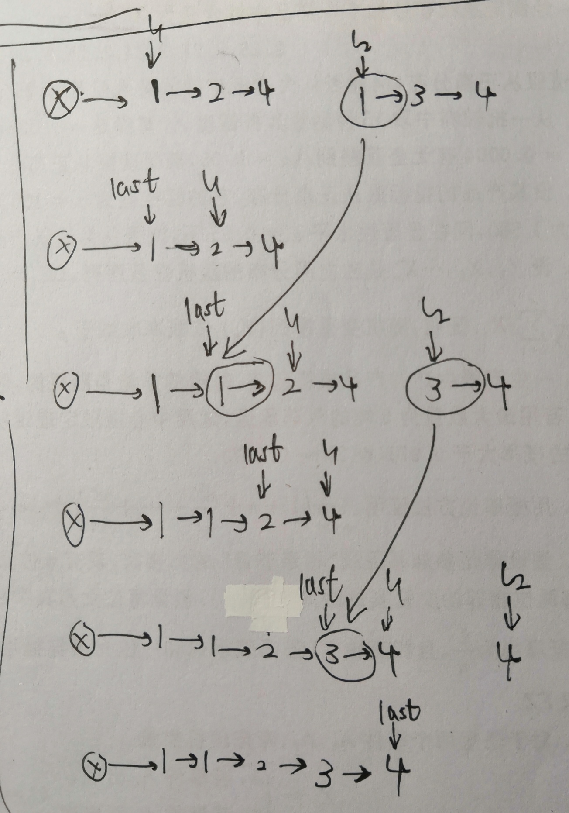

# 题目描述
https://leetcode-cn.com/problems/merge-two-sorted-lists/ <br>
将两个有序链表合并为一个新的有序链表并返回。新链表是通过拼接给定的两个链表的所有节点组成的。

**示例**
>输入：1->2->4, 1->3->4  
>输出：1->1->2->3->4->4

----

## 思路一
> 两个指针，读两个链表，按顺序添加到新链表中
```c++
/**
 * Definition for singly-linked list.
 * struct ListNode {
 *     int val;
 *     ListNode *next;
 *     ListNode(int x) : val(x), next(NULL) {}
 * };
 */
class Solution {
public:
    ListNode* mergeTwoLists(ListNode* l1, ListNode* l2) {
        ListNode sentry(-1);
        ListNode *last = &sentry;
                 
        while( l1 || l2 )
        {
            if( l1 == NULL ){
                ListNode *node = new ListNode(l2->val);
                l2 = l2->next;
                last->next = node;
                last = node;
            }
            else if( l2 == NULL ){
                ListNode *node = new ListNode(l1->val);
                l1 = l1->next;
                last->next = node;
                last = node;
            }
            else{
                if( l1->val < l2->val ){
                    ListNode *node = new ListNode(l1->val);
                    l1 = l1->next;
                    last->next = node;
                    last = node;
                }
                else{
                    ListNode *node = new ListNode(l2->val);
                    l2 = l2->next;
                    last->next = node;
                    last = node;
                }
            }   
        }
        
        return sentry.next;
    }
};
```

## 思路二
> 链表合并  
> 链表1作为基准链表，将链表2的节点插入链表1  


```c++
/**
 * Definition for singly-linked list.
 * struct ListNode {
 *     int val;
 *     ListNode *next;
 *     ListNode(int x) : val(x), next(NULL) {}
 * };
 */
class Solution {
public:
    ListNode* mergeTwoLists(ListNode* l1, ListNode* l2) {
        
        ListNode sentry(-1);
        ListNode *last = &sentry;   // 链表合并点last
        last->next = l1;
        
        while( l1 || l2 )
        {
            // 如果链表2先结束，则没有需要合并的节点了
            if( l2 == NULL ) break;
            
            // 如果链表1先结束，则将剩余的链表2与链表1合并
            else if( l1 == NULL ){
                last->next = l2;
                break;
            }
            // 如果2个链表都未结束
            else{
                // 合并
                if( l2->val < l1->val ){
                    ListNode *temp = l2->next;

                    last->next = l2;
                    last = l2;
                    l2->next = l1;

                    l2 = temp;
                }
                // 不合并
                else{
                    last = l1;
                    l1 = l1->next; 
                } 
            }
            
        }
        
        return sentry.next;
    }
};
```