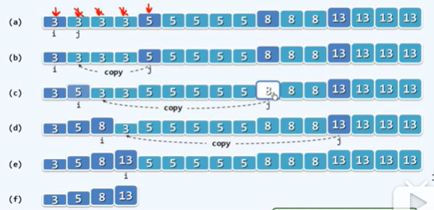

# 题目描述
https://leetcode-cn.com/problems/remove-duplicates-from-sorted-array/ <br>
给定一个排序数组，你需要在原地删除重复出现的元素，使得每个元素只出现一次，返回移除后数组的新长度。   
不要使用额外的数组空间，你必须在**原地修改输入数组**并在使用 O(1) 额外空间的条件下完成。

**示例1:**
>给定数组 nums = [1,1,2],   
>函数应该返回新的长度 2, 并且原数组 nums 的前两个元素被修改为 1, 2。  
>你不需要考虑数组中超出新长度后面的元素。

**示例2:**
>给定数组 nums = [0,0,1,1,1,2,2,3,3,4],   
>函数应该返回新的长度 5, 并且原数组 nums 的前五个元素被修改为 0, 1, 2, 3, 4。  
>你不需要考虑数组中超出新长度后面的元素。


----

## 思路一(88.72%)
> 如图，  
> 注意处理输入向量长度为0或1时的情形，否则i、j会越界


```c++
class Solution {
public:
    int removeDuplicates(vector<int>& nums) {        
        int len = nums.size();
        
        if( len == 0 || len == 1 ) return len;
        
        int i=0; 
        int j=0;
        
        while( ++j < len )
        {
            if( nums[i] != nums[j] ){
                nums[i+1] = nums[j];
                i++;
            }
        }
        
        // cout << i+1;
        return i+1;
    }
};
```