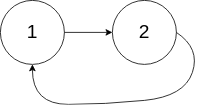

# 题目描述
https://leetcode.cn/problems/linked-list-cycle-ii/ <br>

<!-- <span style="padding: 3px 6px; font-size: 14px; background-color: #FFD700; border: 1px solid #ddd; border-radius: 3px; color: #333; margin-right: 5px;">简单</span> -->
<!-- <span style="padding: 3px 6px; font-size: 14px; background-color: #FF4500; border: 1px solid #ddd; border-radius: 3px; color: #333; margin-right: 5px;">困难</span> -->
<div>
<span style="padding: 3px 6px; font-size: 14px; background-color: #32CD32; border: 1px solid #ddd; border-radius: 3px; color: #333; margin-right: 5px;">中等</span>
<span style="padding: 3px 6px; font-size: 14px; background-color: #f0f0f0; border: 1px solid #ddd; border-radius: 3px; color: #333; margin-right: 5px;">链表</span>
</div>

给定一个链表的头节点  `head` ，返回链表开始入环的第一个节点。 如果链表无环，则返回 `null`。

如果链表中有某个节点，可以通过连续跟踪 next 指针再次到达，则链表中存在环。 为了表示给定链表中的环，评测系统内部使用整数 `pos` 来表示链表尾连接到链表中的位置（索引从 0 开始）。如果 `pos` 是 -1，则在该链表中没有环。注意：`pos` 不作为参数进行传递，仅仅是为了标识链表的实际情况。

不允许修改 链表。

**示例1：**

>输入：head = [3,2,0,-4], pos = 1
>输出：返回索引为 1 的链表节点
>解释：链表中有一个环，其尾部连接到第二个节点。

**示例2：**

>输入：head = [1,2], pos = 0
>输出：返回索引为 0 的链表节点
>解释：链表中有一个环，其尾部连接到第一个节点。

**示例3：**

>输入：head = [1], pos = -1
>输出：返回 null
>解释：链表中没有环。

**提示：**
- 链表中节点的数目范围在范围 [0, 104] 内
- $-10^5 \le$  Node.val $\le 10^5$
- pos 的值为 -1 或者链表中的一个有效索引
----

## 思路一 (哈希)
- 记下链表所有已访问过的Node，如果出现重复，那就是出现了环
>
```python
# Definition for singly-linked list.
# class ListNode:
#     def __init__(self, x):
#         self.val = x
#         self.next = None


class Solution:
    def detectCycle(self, head: Optional[ListNode]) -> Optional[ListNode]:
        if not head:
            return None

        node_set = set()
        cur = head

        while True:

            if cur.next is None:
                return None

            if cur.next in node_set:
                return cur.next

            node_set.add(cur)
            cur = cur.next

        return

```

## 思路二
- 利用快慢指针的思路
    - https://blog.csdn.net/m0_51456787/article/details/123213575
```Python
# Definition for singly-linked list.
# class ListNode:
#     def __init__(self, x):
#         self.val = x
#         self.next = None


class Solution:
    def detectCycle(self, head: Optional[ListNode]) -> Optional[ListNode]:
        if not head:
            return None

        slow, fast = head, head

        # 判断是否存在环路
        while True:
            if not (fast and fast.next):
                return

            slow = slow.next
            fast = fast.next.next

            if fast == slow:
                break

        # 若存在环路，查找环路节点
        fast = head
        while fast != slow:
            slow = slow.next
            fast = fast.next
        return fast
```